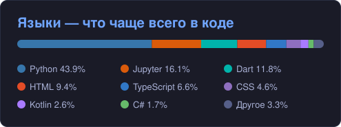
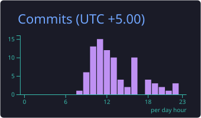

<p align="center">
  
</p>

<p align="center">
  
  <a href="https://t.me/S_h_a_d_o_w_L11"></a>
  <a href="mailto:d.butakov2005@gmail.com"></a>
</p>

<br/>

## 👋 Обо мне

```python
class Daniil:
    role      = "Fullstack / Backend Developer"
    education = "ФИИТ — фундаментальная информатика и IT"
    focus     = ["async backend", "AI-агенты", "чистая архитектура"]
    languages = ["Python", "Dart", "TypeScript", "Kotlin", "C#"]
```

- ⚙️ **Бэкенд на Python / FastAPI** — async, DI через `lagom`, миграции, чистая архитектура
- 📱 **Мобильная разработка на Flutter / Dart** — мой основной фокус в продуктах
- 🤖 **AI-агенты** — оркестрация LLM на LangGraph, мульти-провайдер (Claude / GPT / Gemini)
- 💳 **Коммерческие продукты** — Telegram-боты с платежами, очередями (Redis + arq), Stripe / Apple IAP
- 🔐 **Безопасность всерьёз** — JWT + ротация refresh-токенов с reuse-detection (RFC 9700), rate-limit, шифрование данных
- 💬 Пиши в **[Telegram](https://t.me/S_h_a_d_o_w_L11)** по любой из этих тем

<br/>

## 🛠️ Стек

**Языки**


**Мобильная разработка**


**Бэкенд**


**AI / ML**


**Frontend & Tools**


<br/>

## 🚀 Проекты

> ⭐ **soulGuide** 🔒 — флагманское приложение на **Flutter / Dart**, моя лучшая работа. _(приватный репозиторий)_

**Публичные**

| Проект | О чём | Стек |
|--------|-------|------|
| 🤖 **[AI_Company](https://github.com/SK0LX/AI_Company)** | Оркестрация мульти-агентов: persona-субагенты, live-стрим шагов | `LangGraph` · `LangChain` · `FastAPI` |
| 📡 **[manager_server_for_3x-ui](https://github.com/SK0LX/manager_server_for_3x-ui)** | Менеджер серверов для панели 3x-ui | `Kotlin` |
| 🎵 **[automationTgChannel](https://github.com/SK0LX/automationTgChannel)** | Автоматизация Telegram-каналов | `Python` · `aiogram` |
| 🎲 **[monopoly](https://github.com/SK0LX/monopoly)** | Настольная «Монополия» | `C#` |

**🔒 Приватные / коммерческие**

| Проект | О чём | Стек |
|--------|-------|------|
| 🧘 **MeditationApp + MeditationServer** | Медитации: Flutter-клиент + прод-бэкенд с подписками Stripe / Apple IAP, JWT, S3 | `Flutter` · `FastAPI` · `PostgreSQL` |
| 🖼️ **banner_bot** | Коммерческий Telegram-бот: генерация баннеров, платежи, очередь рендера, Sentry, CI/CD | `aiogram` · `FastAPI` · `Redis` |
| 📋 **kanban** | Фуллстек канбан-доска: JWT access/refresh, RBAC, слои router→service→repo | `FastAPI` · `React` · `PostgreSQL` |
| 💅 **website_for_beauty_salon** | API + витрина салона: услуги, записи, расписание | `FastAPI` · `React` · `Vite` |
| 🤖 **tg_bot** | Telegram Mini App: aiogram-бот, FastAPI-админка, ML-модуль | `aiogram` · `FastAPI` · `ML` |

<br/>

## 📊 Статистика

<p align="center">
  
  
</p>

<p align="center">
  
</p>

<p align="center">
  
</p>

<p align="center">
  
</p>

<p align="center">
  
</p>
